# 0. 项目中所用到的指令合计

| 命令                                                                            | 说明                        |
| :------------------------------------------------------------------------------ | :-------------------------- |
| npm i express-generator -g                                                      | 全局安装express脚手架       |
| npm i -g sequelize-cli                                                          | 全局安装sequelize命令行工具 |
| express --no-view project-name                                                  | 创建项目                    |
| cd project-name                                                                 | 进入项目目录                |
| npm i                                                                           | 安装依赖包                  |
| npm install nodemon -g                                                          | 安装 nodemon                |
| npm i sequelize mysql2                                                          | 安装sequelize和mysql2       |
| sequelize init                                                                  | 初始化 sequelize            |
| npm start                                                                       | 启动项目                    |
| sequelize db:create --charset utf8mb4 --collate utf8mb4_general_ci              | 创建数据库                  |
| sequelize model:generate --name Articles --attributes title:string,content:text | 创建模型                    |
| sequelize db:migrate                                                            | 运行迁移文件                |
| sequelize seed:generate --name articles                                         | 创建种子文件                |
| sequelize db:seed --seed xxx-articles                                           | 运行种子文件                |
| sequelize db:seed:all                                                           | 运行所有种子文件            |

# 1. 创建 express 项目

运行以下命令创建项目

```node
npm install express-generator -g

express --no-view project-name && cd project-name && npm i

npm start
```

`npm install express-generator -g` 全局安装 express

`express --no-view project-name && cd project-name && npm i` 创建项目 并进入项目目录下载依赖包，也可以分布执行:

```node
express --no-view project-name

cd project-name

npm i
```

`npm start` 启动项目

运行成功后，访问 `http://localhost:3000/`

以下是成功安装后的目录结构

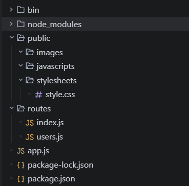

# 2. 使用 nodemon 启动项目

我们在修改文件后往往都是需要重新启动项目的，这样很麻烦，我们可以使用 nodemon 启动项目，nodemon 是一个基于 node.js 的开发工具，它可以监听文件修改并自动重启项目。

1. 使用以下命令安装 nodemon

```node
npm install nodemon -g
```

2. 打开package.json文件，修改以下代码，将start改为nodemon ./bin/www

```json
{
  "name": "clwy-api",
  "version": "0.0.0",
  "private": true,
  "scripts": {
    "start": "nodemon ./bin/www"
  },
  "dependencies": {
    "cookie-parser": "~1.4.4",
    "debug": "~2.6.9",
    "express": "~4.16.1",
    "morgan": "~1.9.1",
    "nodemon": "^3.1.14"
  }
}
```

这样我们修改代码后只需要重新刷新页面即可

# 3. 使用docker-desktop运行项目

## 在官网下载`docker-desktop`

- 下载地址：https://www.docker.com/products/docker-desktop/

- windows 下载 AMD64

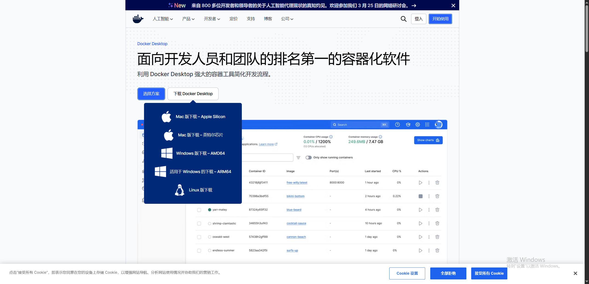

- 下载后启动

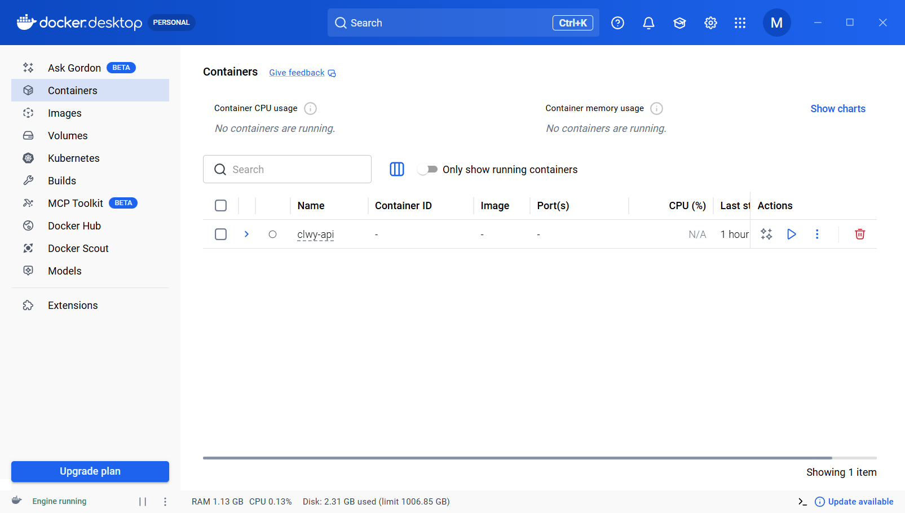

## 启动项目

- 运行以下命令启动项目，使用以下指令启动项目，也可以在`docker desktop`中启动项目

```bash
docker compose up -d
```


## 在启动docker-desktop所遇到的问题

1. docker-desktop启动失败，双击启动后又退出，无法启动

- Windows功能被禁用了，我们需要打开`控制面板`找到程序->`启用或关闭Windows功能`

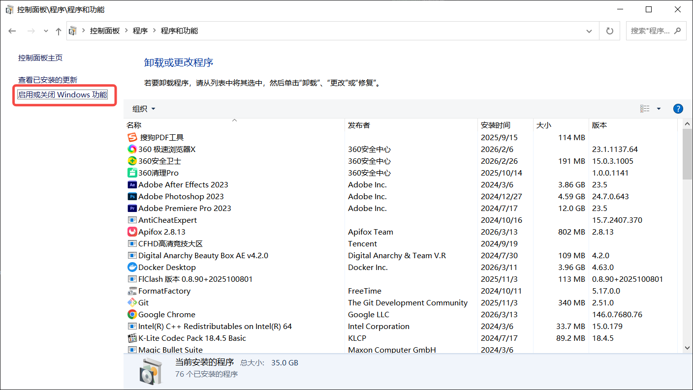

- 将下图所示的勾选，然后重启电脑即可：

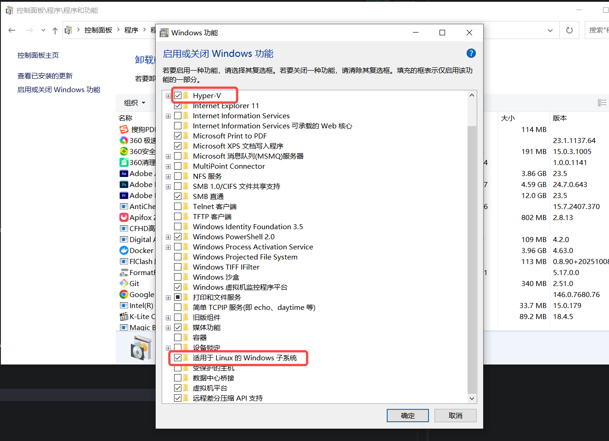

2. xsl版本太低了，使用以下指令升级xsl版本：

```bash
wsl --update
```

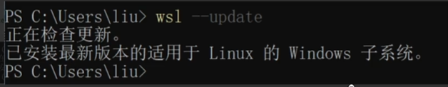

3. 有些系统找不到Hyper-V，比如windows10家庭版

- 新建一个Hyper.cmd文件，以管理员权限运行跑完指令后重启，内容如下：

```bash
pushd "%~dp0"
dir /b %SystemRoot%\servicing\Packages\*Hyper-V*.mum >hyper-v.txt
for /f %%i in ('findstr /i . hyper-v.txt 2^>nul') do dism /online /nore
start /add-package:"%SystemRoot%\servicing\Packages\%%i"
del hyper-v.txt
Dism /online /enable-feature /featurename:Microsoft-Hyper-V-All /LimitA
ccess /ALL
```

## 配置阿里云的docker镜像，让访问更快

- 打开设置

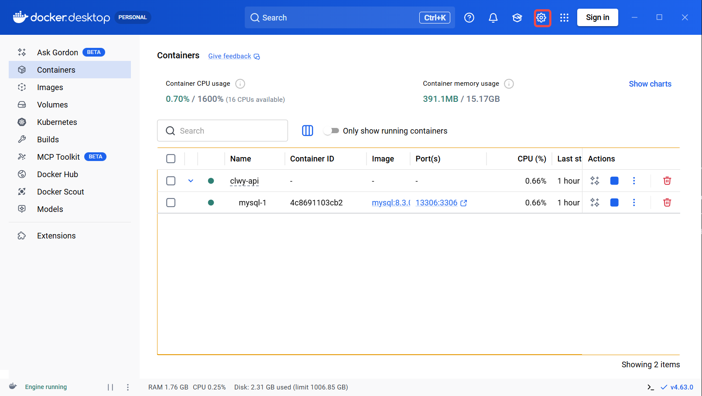

- 添加阿里云的镜像源：

```bash
{
  "builder": {
    "gc": {
      "defaultKeepStorage": "20GB",
      "enabled": true
    }
  },
  "experimental": false,
  "registry-mirrors": [
    "https://docker.1ms.run"
  ]
}
```

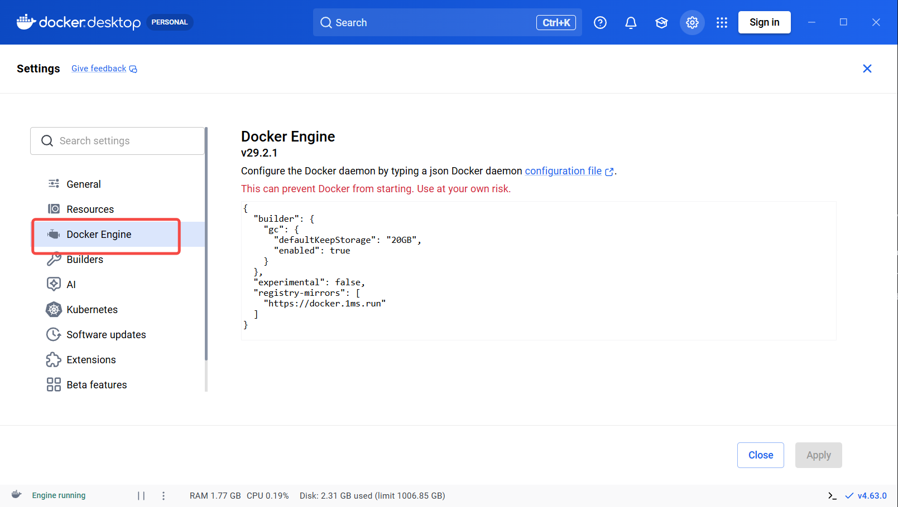

# 4. 安装 sequelize

1. 全局安装`sequelize-cli`

```bash
npm i -g sequelize-cli
```

2. 安装`sequelize`和`mysql2`，这个是`sequelize`中文文档 `https://www.sequelize.cn/`

```bash
npm i sequelize mysql2
```

3. 初始化项目

```bash
sequelize init
```

- 初始化后会生成以下文件

  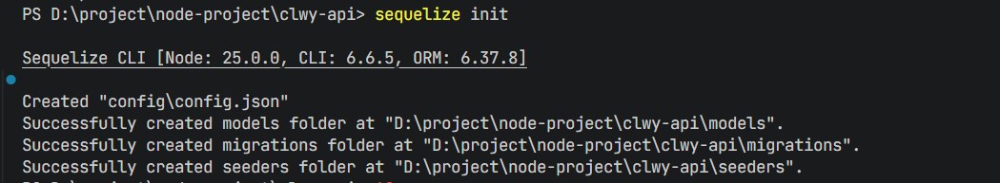

- 项目对应的文件

  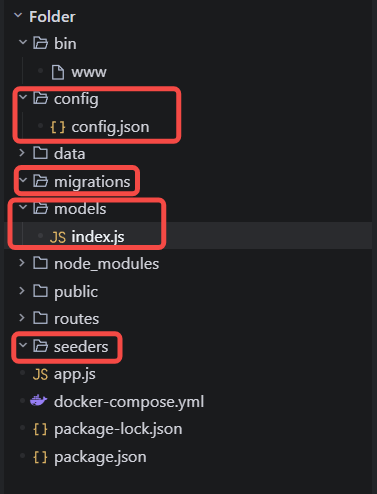

## 项目文件解析

- `config/config.json` 项目的配置文件，里面存放着不同环境下（development-开发环境、test-测试环境、production-生产环境）的数据库的配置信息，比如数据库的连接地址、用户名、密码、数据库名等等，需要把对应的配置信息填写进去。

  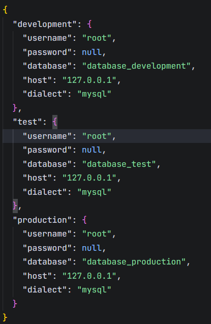

- `migrations` 文件夹存放着数据库迁移文件，比如创建数据库表、添加字段等等。

- `models` 文件夹存放着数据库模型文件，比如定义数据库表结构、字段类型、字段约束等等。

- `seeders` 文件夹存放着数据填充文件，比如初始化数据库数据等等。

## 使用 sequelize

1. 使用以下命令创建一个模型文件（创建一个Articles模型文件，字段为title和content）：

```bash
sequelize model:generate --name Articles --attributes title:string,content:text
```

- 创建成功后，会在`models`文件夹下生成一个`articles.js`模型文件，migrations文件夹会生成一个`时间戳-create-articles.js`迁移文件，内容如下：

`articles.js`文件内容：

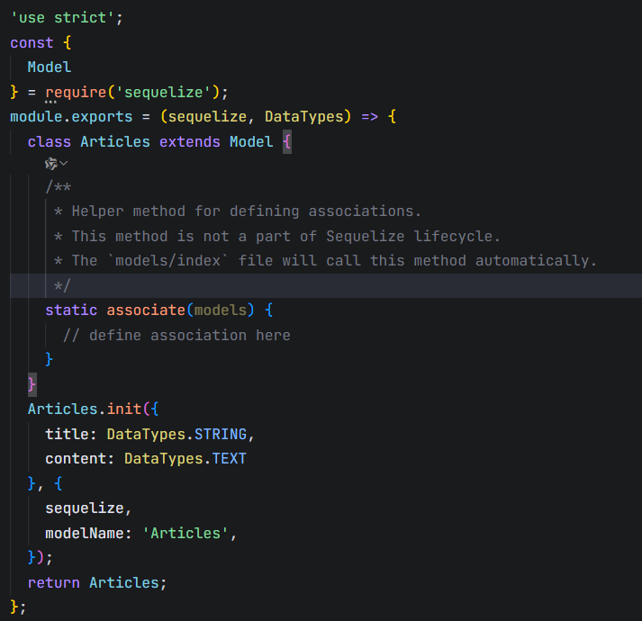

`时间戳-create-articles.js`文件内容：

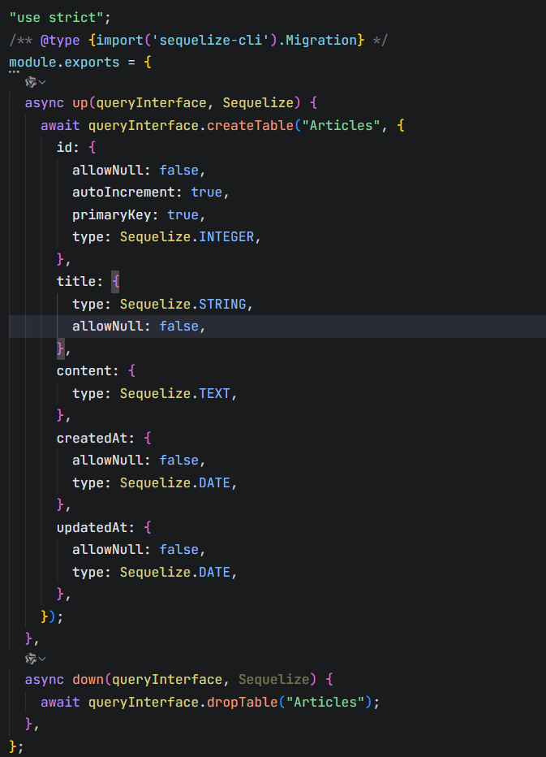

2. 使用以下命令执行迁移文件，会在数据库中创建`articles`表：

```bash
sequelize db:migrate
```

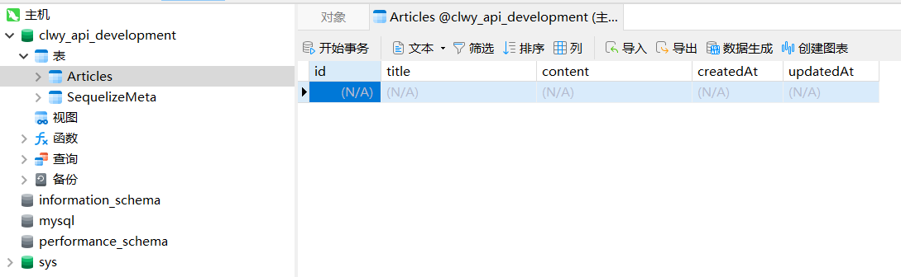

3. 使用以下命令创建`articles`种子文件：

```bash
sequelize seed:generate --name articles
```

- 执行后会在`seeders`文件夹下生成一个`时间戳-articles.js`种子文件：

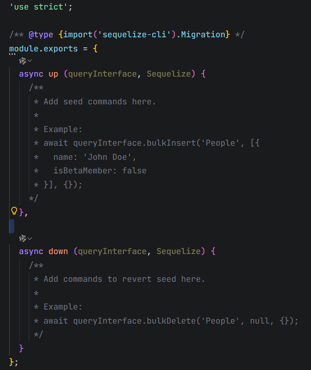

4. 修改`articles`种子文件，循环创建100条数据：

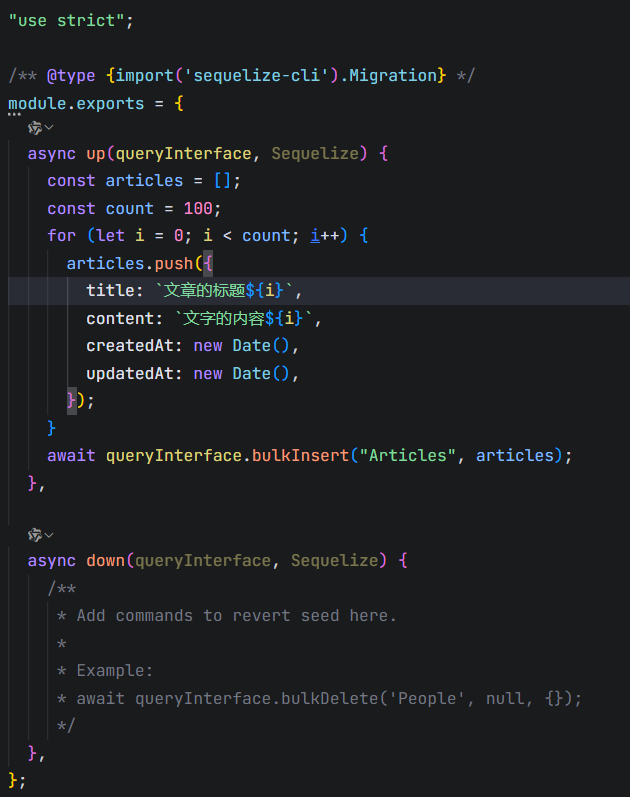

5. 使用以下命令执行种子文件，将数据插入到数据库中，注意`xxx-articles`为文件名称，比如：20191030145405-articles：

```bash
sequelize db:seed --seed xxx-articles
```

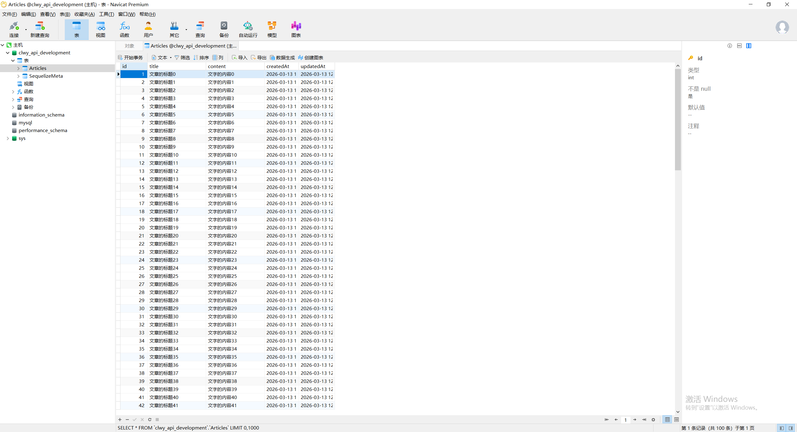

# 5. 实现增删改查接口

## 查询所有文章数据

1. 在`routes` 目录下创建 `admin`文件夹，并在该文件夹下创建 `article.js` 文件，并添加以下代码：

```javascript
const express = require("express");
const router = express.Router();

const { Articles } = require("../../models");
const { Op } = require("sequelize");

/* GET Articles. */
router.get("/", async function (req, res, next) {
  try {
    const condition = {
      order: [["id", "DESC"]],
    };
    const query = req.query;
    if(query.title) {
      // 模糊查询
      condition.where = {
        title: [Op.like]: `%${query.title}%`
      }
    }
    const articles = await Articles.findAll(condition);
    res.json({ status: true, data: { data: articles }, message: "查询成功" });
  } catch (error) {
    res.status(500).json({ status: false, data: null, message: error.message });
  }
});

module.exports = router;
```

- `findAll` 方法用于查询所有数据，具体其它的查询方法请自行查看官方文档 https://www.sequelize.cn/。

2. 在 `app.js`文件中添加以下代码：

```javascript
// 后台路由文件
const adminArticlesRouter = require("./routes/admin/articles");

// 后台路由配置
app.use("/admin/articles", adminArticlesRouter);
```

3. 在apifox或postman中访问 `http://localhost:3000/admin/articles`，即可看到后台文章列表：

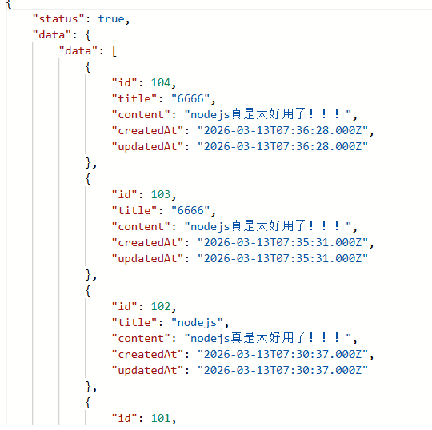

## 查询文章列表数据（分页）

1. 在`routes` 目录下创建 `admin`文件夹，并在该文件夹下创建 `article.js` 文件，并添加以下代码：

```javascript

/* GET Articles. */
router.get("/page", async function (req, res, next) {
  try {
    const { page = 1, limit = 10, title = "" } = req.query;
    const condition = {
      order: [["id", "DESC"]],
      limit: Number(limit),
      offset: (Number(page) - 1) * Number(limit),
    };
    if(title) {
      // 模糊查询
      condition.where = {
        title: [Op.like]: `%${title}%`
      }
    }
    const { count, rows } = await Articles.findAll(condition);
    res.json({ status: true, data: { data: rows, total: count, limit, page }, message: "查询成功" });
  } catch (error) {
    res.status(500).json({ status: false, data: null, message: error.message });
  }
});
```

## 查询文章详情

1. 在`routes/admin/articles.js`文件中添加以下代码：

```javascript
/* GET 查询文章详情数据 */
router.get("/:id", async function (req, res, next) {
  try {
    const { id } = req.params;
    if (!id)
      return res
        .status(400)
        .json({ status: false, data: null, message: "id不能为空" });
    const article = await Articles.findByPk(id);
    if (!article)
      return res
        .status(404)
        .json({ status: false, data: null, message: "文章不存在" });
    res.json({ status: true, data: { data: article }, message: "查询成功" });
  } catch (error) {
    res.status(500).json({ status: false, data: null, message: error.message });
  }
});
```

2. 在apifox或postman中访问 `http://localhost:3000/admin/articles/1`，即可看到后台文章列表：

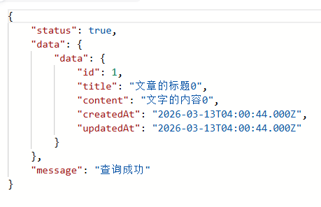

## 创建文章

1. 在`routes/admin/articles.js`文件中添加以下代码：

```javascript
/* POST 创建文章 */
router.post("/", async function (req, res, next) {
  try {
    const { title, content } = req.body;
    if (!title)
      return res
        .status(400)
        .json({ status: false, data: null, message: "标题不能为空" });
    const result = await Articles.create({
      title,
      content,
    });
    res.json({ status: true, data: { data: result }, message: "创建成功" });
  } catch (error) {
    res.status(500).json({ status: false, data: null, message: error.message });
  }
});
```

2. 在apifox或postman中访问 `http://localhost:3000/admin/articles`，填写body参数，即可看到后台文章列表：

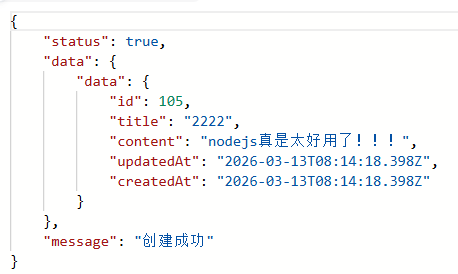

## 修改文章

1. 在`routes/admin/articles.js`文件中添加以下代码：

```javascript
/* PUT 修改文章 */
router.put("/", async function (req, res, next) {
  try {
    const { id, title, content } = req.body;
    if (!id || !title) {
      return res
        .status(400)
        .json({ status: false, data: null, message: "参数错误" });
    }
    const article = await Articles.findByPk(id);
    if (!article)
      return res
        .status(400)
        .json({ status: false, data: null, message: "文章不存在" });
    const result = await Articles.update({ title, content }, { where: { id } });
    res.json({ status: true, data: { data: result }, message: "修改成功" });
  } catch (error) {
    res.status(500).json({ status: false, data: null, message: error.message });
  }
});
```

2. 在apifox或postman中访问 `http://localhost:3000/admin/articles`，填写body参数，即可看到后台文章列表：

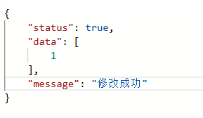

## 删除文章

1. 在`routes/admin/articles.js`文件中添加以下代码：

```javascript
/* DELETE 删除文章 */
router.delete("/:id", async function (req, res, next) {
  try {
    const { id } = req.params;
    if (!id)
      return res
        .status(400)
        .json({ status: false, data: null, message: "id不能为空" });
    const article = await Articles.findByPk(id);
    if (!article)
      return res
        .status(400)
        .json({ status: false, data: null, message: "文章不存在" });
    const result = await Articles.destroy({
      where: { id },
    });
    res.json({ status: true, data: { data: result }, message: "删除成功" });
  } catch (error) {
    res.status(500).json({ status: false, data: null, message: error.message });
  }
});
```

2. 在apifox或postman中访问 `http://localhost:3000/admin/articles/1`，即可看到后台文章列表：

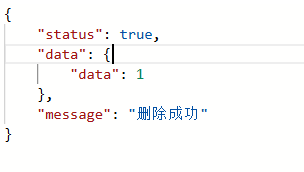

# 6. 验证表单数据

当我们在创建、修改、删除文章时，需要验证表单数据，比如标题和内容不能为空，否则会报错，如果判断十分多，if else 嵌套起来会很麻烦，并且可读性不高，那么我们可以在模型文件内容加入验证规则，如：

```javascript
// /models/articles.js
"use strict";
const { Model } = require("sequelize");
module.exports = (sequelize, DataTypes) => {
  class Articles extends Model {
    /**
     * Helper method for defining associations.
     * This method is not a part of Sequelize lifecycle.
     * The `models/index` file will call this method automatically.
     */
    static associate(models) {
      // define association here
    }
  }
  Articles.init(
    {
      title: {
        type: DataTypes.STRING,
        allowNull: false,
        validate: {
          notNull: {
            msg: "标题必须存在",
          },
          notEmpty: {
            msg: "标题不能为空",
          },
          len: {
            args: [2, 45],
            msg: "标题长度必须在2-45个字符之间",
          },
        },
      },
      content: DataTypes.TEXT,
    },
    {
      sequelize,
      modelName: "Articles",
    },
  );
  return Articles;
};
```

- `allowNull: false` 表示该字段不能为空
- `validate: { notNull: { msg: "标题必须存在" } }` 验证标题字段必须存在
- `validate: { notEmpty: { msg: "标题不能为空" } }` 验证标题字段不能为空
- `validate: { len: { args: [2, 45], msg: "标题长度必须在2-45个字符之间" } }` 验证标题字段长度必须在2-45个字符之间

验证规则添加成功后，再次访问 `http://localhost:3000/admin/articles`，可以看到表单验证效果：

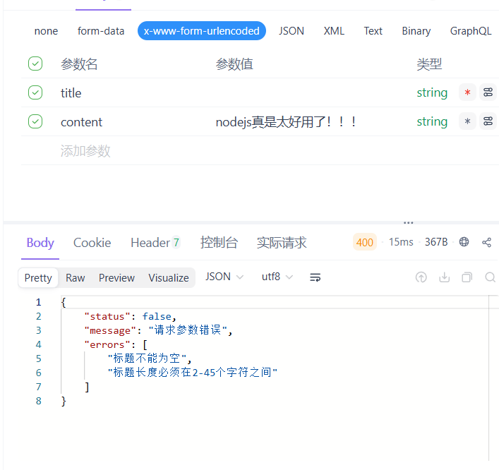

# 7. 对增删改查操作进行代码优化，封装响应函数

1. 在根目录下件夹创建`utils`文件夹，并添加`response.js`文件，内容如下：

```javascript
/* 自定义 404 错误类 */
class NotFoundError extends Error {
  constructor(message) {
    super(message);
    this.name = "NotFoundError";
  }
}

/* 自定义查询成功函数
 * @param res Objext
 * @param message String
 * @param data Object
 * @param code Number
 */
function success(res, message, data, code = 200) {
  res.status(code).json({
    status: true,
    data,
    message,
  });
}

/* 自定义失败函数
 * @param res Objext
 * @param error Object
 */
function failure(res, error) {
  // 判断错误类型
  if (error.name === "SequelizeValidationError") {
    const errors = error.errors.map((message) => message.message);
    return res.status(400).json({
      status: false,
      message: "请求参数错误",
      errors,
    });
  }

  if (error.name === "NotFoundError") {
    return res.status(404).json({
      status: false,
      message: "资源不存在",
      errors: [error.message],
    });
  }
  return res.status(500).json({
    status: false,
    message: "服务器错误",
    errors: [error.message],
  });
}

module.exports = {
  NotFoundError,
  success,
  failure,
};
```

- NotFoundError 自定义 404 错误类
- success 自定义查询成功函数
- failure 自定义失败函数

2. 将成功响应和错误代码替换为对应的封装响应：

```javascript
const express = require("express");
const router = express.Router();

const { Articles } = require("../../models");
const { Op } = require("sequelize");
const { NotFoundError, success, failure } = require("../../utils/response");

/* GET 查询所有文章数据 */
router.get("/", async function (req, res, next) {
  try {
    const condition = {
      order: [["id", "DESC"]],
    };
    const query = req.query;
    if (query.title) {
      // 模糊查询
      condition.where = { title: { [Op.like]: `%${query.title}%` } };
    }
    const articles = await Articles.findAll(condition);
    success(res, "查询成功", { data: articles });
  } catch (error) {
    failure(res, error);
  }
});

/* 分页查询文章数据 */
router.get("/page", async function (req, res, next) {
  try {
    const { limit = 10, page = 1, title = "" } = req.query;
    const condition = {
      limit: Number(limit),
      offset: (Number(page) - 1) * Number(limit),
      order: [["id", "DESC"]],
    };
    if (title) {
      condition.where = { title: { [Op.like]: `%${title}%` } };
    }
    const { count, rows } = await Articles.findAndCountAll(condition);
    success(res, "查询成功", {
      data: rows,
      total: count,
      page: Number(page),
      limit: Number(limit),
    });
  } catch (error) {
    failure(res, error);
  }
});

/* GET 查询文章详情数据 */
router.get("/:id", async function (req, res, next) {
  try {
    const { id } = req.params;
    if (!id) throw new NotFoundError("id不能为空");
    const article = await getArticle(id);
    if (!article) throw new NotFoundError("文章不存在");
    success(res, "查询成功", { data: article });
  } catch (error) {
    failure(res, error);
  }
});

/* POST 创建文章 */
router.post("/", async function (req, res, next) {
  try {
    const { title, content } = req.body;
    const result = await Articles.create({
      title,
      content,
    });
    success(res, "创建成功", { data: result });
  } catch (error) {
    failure(res, error);
  }
});

/* PUT 修改文章 */
router.put("/", async function (req, res, next) {
  try {
    const { id, title, content } = req.body;
    if (!id || !title) {
      throw new NotFoundError("id或标题不能为空");
    }
    const article = await getArticle(id);
    if (!article) throw new NotFoundError("文章不存在");
    const result = await Articles.update({ title, content }, { where: { id } });
    success(res, "修改成功", { data: result });
  } catch (error) {
    failure(res, error);
  }
});

/* DELETE 删除文章 */
router.delete("/:id", async function (req, res, next) {
  try {
    const { id } = req.params;
    if (!id) throw new NotFoundError("id不能为空");
    const article = await getArticle(id);
    if (!article) throw new NotFoundError("文章不存在");
    const result = await Articles.destroy({
      where: { id },
    });
    success(res, "删除成功", { data: result });
  } catch (error) {
    failure(res, error);
  }
});

module.exports = router;

async function getArticle(id) {
  return await Articles.findByPk(id);
}
```
