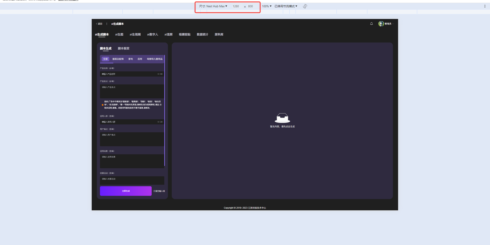
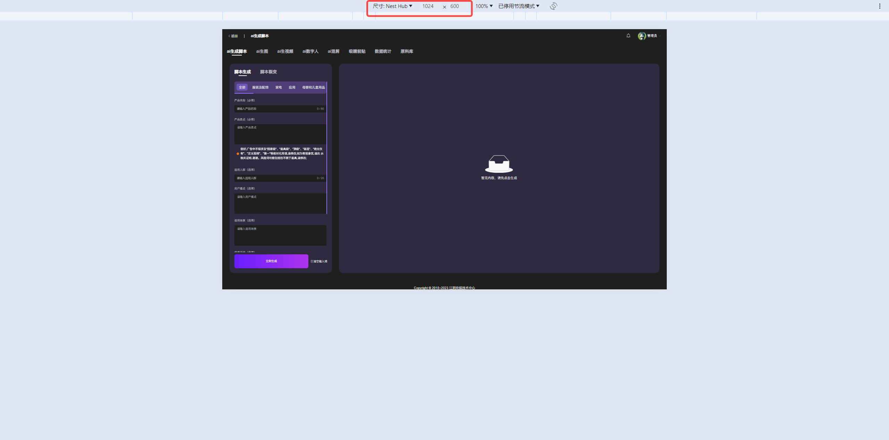

# vite 配置

```javascript
import { defineConfig, loadEnv } from "vite";
import AutoImport from "unplugin-auto-import/vite";
import Components from "unplugin-vue-components/vite";
import { ElementPlusResolver } from "unplugin-vue-components/resolvers";
import vue from "@vitejs/plugin-vue";
import path from "path";
import gzipPlugin from "rollup-plugin-gzip"; // ← 正确导入

export default defineConfig(({ mode }) => {
  const env = loadEnv(mode, process.cwd(), ""); // 获取环境变量
  return {
    build: {
      minify: "esbuild",
      target: "es2015",
      esbuild: {
        drop: ["console", "debugger"], // 删除 console.log
      },
    },
    css: {
      preprocessorOptions: {
        scss: {
          additionalData: `@import "@/styles/global.scss";`, // 引入全局样式
        },
      },
      postcss: "./postcss.config.cjs", // 明确指向 .cjs 文件
    },
    resolve: {
      alias: {
        "@": path.resolve(__dirname, "src"), // 配置别名
      },
      // 👇 关键：添加 .vue 到自动解析的扩展名列表，在引入时可忽略后缀
      extensions: [".js", ".json", ".jsx", ".mjs", ".ts", ".tsx", ".vue"],
    },
    // 👇 添加插件
    plugins: [
      vue(),
      gzipPlugin({
        filter: (fileName, source) => {
          if (!source) return false; // 空文件不压缩

          const size =
            typeof source === "string"
              ? Buffer.byteLength(source)
              : source.length || source.byteLength || 0;

          return size > 10 * 1024;
        },
      }),
      AutoImport({
        resolvers: [ElementPlusResolver()], // 默认导入 element-plus
        imports: ["vue", "vue-router", "vuex"], // 默认导入 vue
      }),
      Components({
        resolvers: [ElementPlusResolver()], // 默认导入 element-plus
      }),
    ],
    server: {
      proxy: {
        // 配置代理
        "/api": {
          // 拦截以 /api 开头的请求
          target: env.VITE_API_BASE, // 接口域名
          changeOrigin: true, //是否跨域
        },
      },
    },
    build: {
      outDir: `dist/${mode}`, // 输出目录
    },
  };
});
```

# 在 `vite` + `vue` 中 结合 `postcss` + `postcss-pxtorem` + `autoprefixer` 配置 `px` 转 `rem`

1. 安装 `postcss` `postcss-pxtorem` `autoprefixer`：

```bush
npm i postcss postcss-pxtorem autoprefixer -D
```

2. 在 `vite.config.js` 文件平级目录下创建 `postcss.config.cjs` 文件，添加以下代码：

```javascript
// postcss.config.js
module.exports = {
  plugins: {
    autoprefixer: {}, // 可选，但推荐用于添加浏览器前缀
    "postcss-pxtorem": {
      rootValue: 16, // 设计稿基准字体大小，通常为 16px
      unitPrecision: 5, // 保留小数点后几位
      propList: ["*"], // 需要转换的属性，* 表示所有
      selectorBlackList: [], // 忽略的选择器
      replace: true, // 是否直接替换而不是添加新属性
      mediaQuery: false, // 是否转换媒体查询中的 px
      minPixelValue: 1, // 小于该值的 px 不会被转换
    },
  },
};
```

3. 在 `vite.config.js` css 中添加以下代码

```javascript
export default defineConfig(() => {
  return {
    css: {
      postcss: "./postcss.config.cjs", // 明确指向 .cjs 文件
    },
  };
});
```

4. 创建 `setRem.js` 文件，添加以下代码：

```javascript
/**
 * 动态设置根元素的字体大小
 * @param {number} designWidth - 设计稿的宽度
 */
function setRem(designWidth) {
  const docEl = document.documentElement;
  const resizeEvt =
    "orientationchange" in window ? "orientationchange" : "resize";

  const recalc = () => {
    const clientWidth = docEl.clientWidth;
    if (!clientWidth) return;
    // 根据设计稿宽度计算根元素字体大小
    docEl.style.fontSize = 16 * (clientWidth / designWidth) + "px";
  };

  if (!document.addEventListener) return;
  window.addEventListener(resizeEvt, recalc, false);
  document.addEventListener("DOMContentLoaded", recalc, false);
}
setRem(1920);

export default setRem;
```

5. 在 `main.js` 中引入 `setRem.js` 文件，并调用 `setRem` 函数：

```javascript
import "./setRem.js";
```

6. 效果图：

- 在不同尺寸的设备上查看效果




