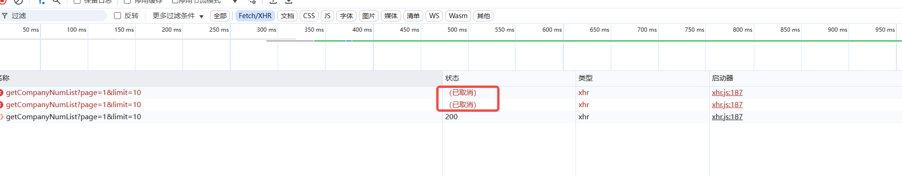

## Axios 使用 CancelToken 控制请求 示例

使用axios.CancelToken来控制请求，可以在请求发送前，添加取消令牌到请求配置中。 当需要取消请求时，调用取消令牌的函数即可。

```javascript
// 引入 axios 库
import axios from "axios";

// 创建 axios 实例
const http = axios.create({
  baseURL: import.meta.env.VITE_BASE_URL,
  timeout: 10000,
});
// 用于存储取消令牌的 Map
const cancelTokens = new Map();

/**
 * 获取取消令牌Key
 * @param {*} config axios 请求配置
 */
function getCancelTokenKey(config) {
  const { method, url, params, data } = config;
  return `${method}_${url}${JSON.stringify(params)}_${JSON.stringify(data)}`;
}

/**
 * 添加取消令牌到请求配置
 * @param {*} config axios 请求配置
 */
function addCancelToken(config) {
  const requestKey = getCancelTokenKey(config);
  cancelRequest(config, requestKey);

  // 限制手动添加 cancelToken
  if (config.cancelToken) {
    throw new Error("不能手动添加 cancelToken");
  }

  const source = axios.CancelToken.source();
  config.cancelToken = source.token;
  cancelTokens.set(requestKey, source.cancel);

  return config;
}

/**
 * 移除取消令牌
 * @param {*} config axios 请求配置
 */
function removeCancelToken(config) {
  const requestKey = getCancelTokenKey(config);
  if (cancelTokens.has(requestKey)) {
    cancelTokens.delete(requestKey);
  }
}

/**
 * 取消指定请求
 * @param {*} config axios 请求配置
 */
export function cancelRequest(config, key) {
  const requestKey = key || getCancelTokenKey(config);
  if (cancelTokens.has(requestKey)) {
    cancelTokens.get(requestKey)("请求被取消");
    cancelTokens.delete(requestKey);
  }
}

/**
 * 取消所有请求
 */
export function cancelAllRequest() {
  for (const cancel of cancelTokens.values()) {
    cancel("所有请求被取消");
  }
  cancelTokens.clear();
}

/**
 * 拦截请求
 */
http.interceptors.request.use(
  (config) => {
    // 有 token 时，添加到请求头
    const token = localStorage.getItem("token");
    if (token) {
      config.headers["Authorization"] = token;
    }
    // 添加取消令牌
    return addCancelToken(config);
  },
  (error) => {
    return Promise.reject(error);
  },
);

/**
 * 拦截响应
 */
http.interceptors.response.use(
  (response) => {
    // 成功响应时，移除取消令牌
    removeCancelToken(response.config);
    return response;
  },
  (error) => {
    // 取消请求时提示
    if (axios.isCancel(error)) {
      console.error(error.message);
      // 可以根据需要返回特定的响应或空对象
      return Promise.resolve({
        data: { code: 1001, msg: "请求已取消", data: null },
      });
    }
    return Promise.reject(error);
  },
);
```

效果图：


注意：在使用取消令牌时，需要注意以下几点：

1. 取消令牌只能取消一次，重复调用取消令牌函数将无效。
2. 取消令牌只能在请求发送前添加，不能在请求发送后添加。
3. 取消令牌只能取消当前正在发送的请求，不能取消已经发送完成的请求。
4. 取消令牌需要把请求的config对象作为参数传递给取消令牌函数，才能取消对应的请求。
