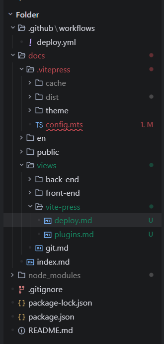
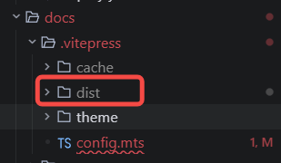
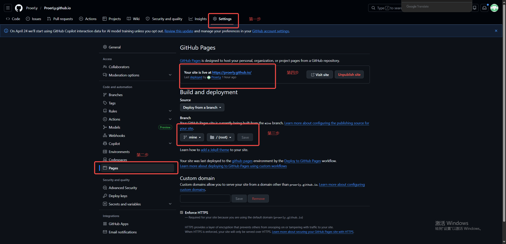

# 使用github pages 部署vitePress 文档

## 1.创建vitepress 项目

```bash
npm add -D vitepress@next
npm install
```

## 2.项目结构



- 必须的文件
  - `.github/workflows/deploy.yml` 部署工作流文件
  - `docs/.vitepress/theme` 自定义主题目录
  - `docs/.vitepress/config.mts` 配置文件
  - `views` 目录下存放所有的文档
  - `index.md` 首页文件
  - `.gitignore` 忽略文件
  - `package.json` 项目依赖文件
  - `package-lock.json` 依赖锁文件

## 3.创建`.github/workflows/deploy.yml`文件

```yml
# .github/workflows/deploy.yml
name: Deploy to GitHub Pages

on:
  # 在 mine 分支有 push 或手动触发时运行
  push:
    branches: [mine]
  workflow_dispatch:

# 授予 GITHUB_TOKEN 权限
permissions:
  contents: read
  pages: write
  id-token: write

# 允许取消正在进行的相同工作流
concurrency:
  group: "pages"
  cancel-in-progress: true

jobs:
  # 构建任务
  build:
    runs-on: ubuntu-latest
    steps:
      - name: Checkout
        uses: actions/checkout@v4
        with:
          fetch-depth: 0 # 获取所有历史记录以支持 last-updated

      - name: Setup Node
        uses: actions/setup-node@v4
        with:
          node-version: 18
          cache: npm

      - name: Install dependencies
        run: npm install

      - name: Build VitePress site
        run: |
          # 显式指定配置路径，避免歧义
          npx vitepress build docs --config docs/vitepress/config.mts || \
          npx vitepress build docs --config docs/.vitepress/config.mts

      - name: Copy dist to root
        run: |
          mkdir -p temp-dist
          cp -r docs/.vitepress/dist/* temp-dist/ || cp -r docs/vitepress/dist/* temp-dist/
          rm -f *.html *.css *.js && cp -r temp-dist/* .

      - name: Upload artifact
        uses: actions/upload-pages-artifact@v3
        with:
          path: ./ # 上传整个根目录，因为 User Site 必须从此处提供服务

  # 部署任务
  deploy:
    environment:
      name: github-pages
      url: ${{ steps.deployment.outputs.page_url }}
    runs-on: ubuntu-latest
    needs: build
    steps:
      - name: Deploy to GitHub Pages
        id: deployment
        uses: actions/deploy-pages@v4
```

- 注意：branches: [mine] 这里的mine 是你要部署的分支，你可以根据自己的需求修改

## 4.修改`package.json`文件内容

```json
{
  "scripts": {
    "deploy": "bash deploy.sh",
    "docs:dev": "vitepress dev docs",
    "docs:build": "vitepress build docs",
    "docs:preview": "vitepress preview docs"
  },
  "devDependencies": {
    "vitepress": "^1.0.0",
    "vitepress-plugin-group-icons": "^1.6.5"
  }
}
```

## 5.进行文件构建

查看`dist`目录是否生成

```bash
npm run docs:build
```



## 6.将代码提交到分支

这里假设你要部署的分支是`mine`，你可以根据自己的需求修改

```bash
git add .
git commit -m "deploy"
git push origin mine
```

## 7.登录github进入项目仓库

- 进入`Settings` -> `Pages` 页面
- 选择`Deploy from a branch` 分支部署
- 选择`mine` 分支
- 选择`/root` 目录
- 点击`Save` 保存
- 等待部署完成
- 部署完成后，点击链接查看部署效果



- 部署效果


## 8.注意事项

- 在配置config.mts 文件时，需要注意的是，需要将base 配置为`/`，否则会导致部署后访问路径错误

```typescript
// config.mts
export default defineConfig({
  base: "/",
});
```

- `.gitignore` 文件中需要添加`node_modules`、`dist`、`cache`目录，这些目录都是构建时生成的，需要忽略掉

```bash
# .gitignore
.DS_Store
node_modules
docs/.vitepress/dist/
docs/.vitepress/cache/
```
